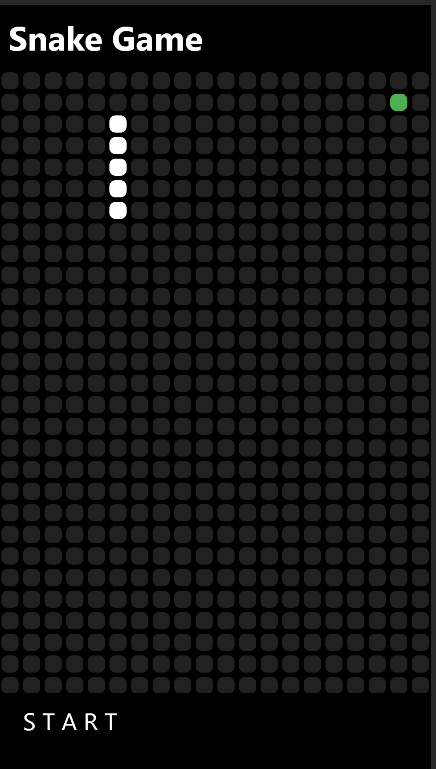
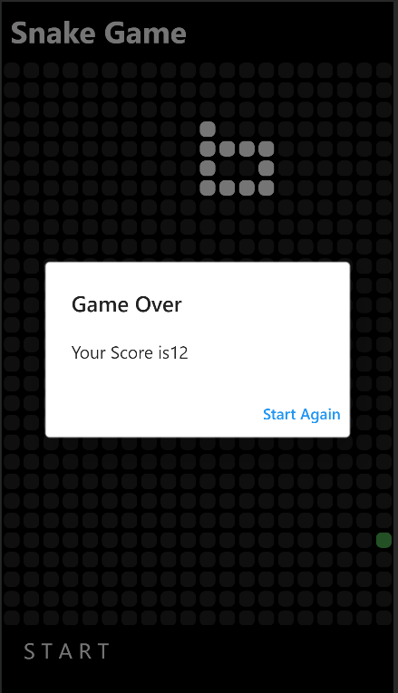

# Snake Game

## Introduction

Snake game is the simple flutter game which is mainly focused on the logic rather than the
User Interface. User Interface is very simple to use.

## Project Information

Here to use this application users need to swap to give the directions to the snake.\

- Length of snake will grow after eating a food.
- food will appear in a random place in a green color
- When snake touches own body then the game will be over.
- Total Score will be calcualted by the length of snake.

## Game sample

## Note

This is one of the best project to obtain best result from simple logic and UI.
All thanks to [Mitch Koko](https://www.youtube.com/channel/UCVj9dwfXRmwyYmiWnk-qCCQ)
